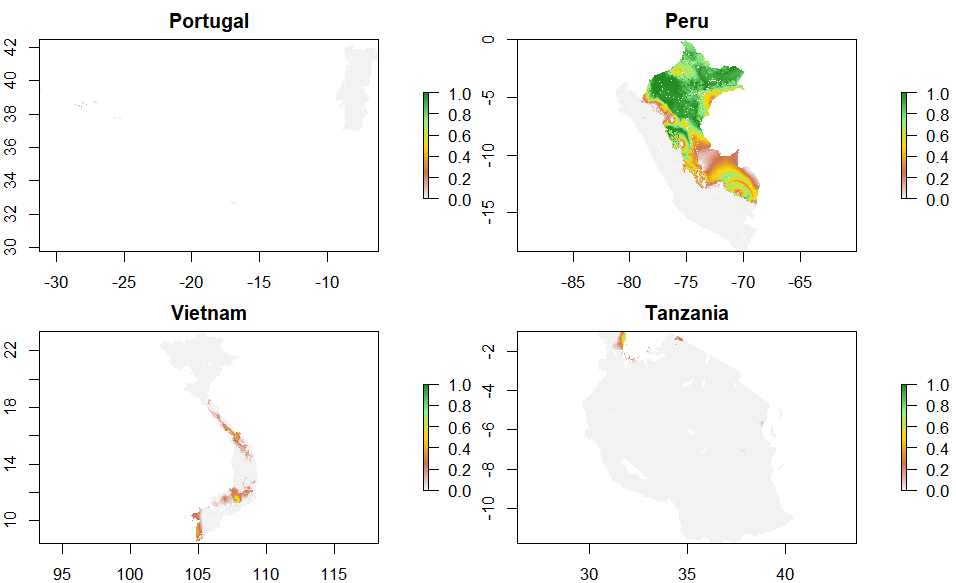
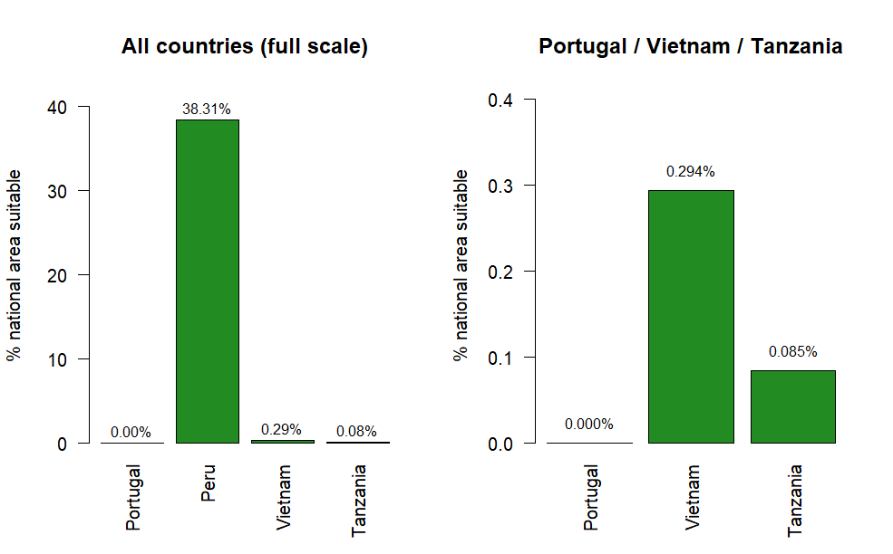
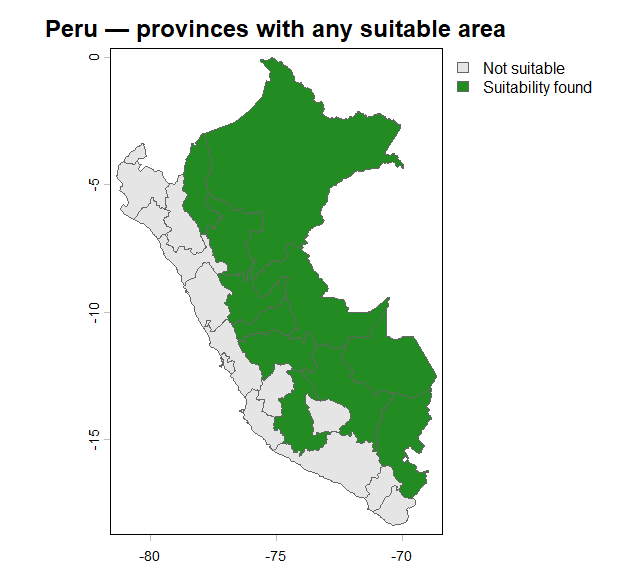
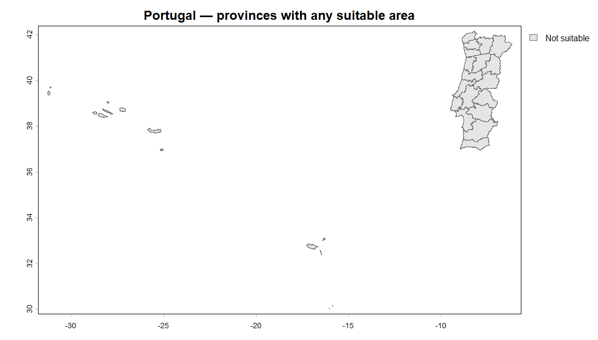
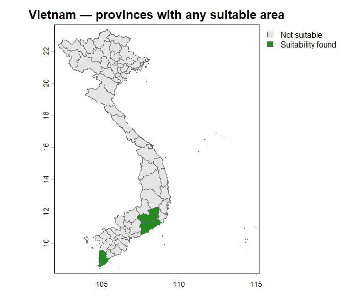
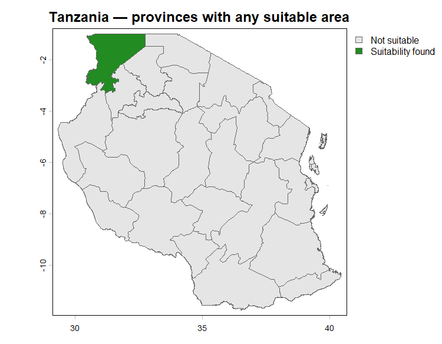
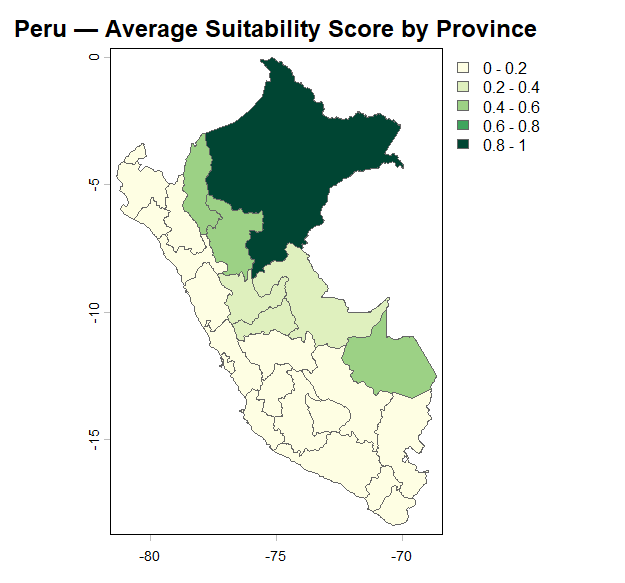

# Assessing-Global-Suitability-for-a-Novel-Nut-Tree


A spatial agro-climatic suitability modeling workflow built to evaluate the feasibility of deploying a novel, high-yielding, grain-replacing nut tree crop across four distinct global climates: **Peru**, **Portugal**, **Vietnam**, and **Tanzania**[cite: 19].

Developed for the *Crop Suitability Modelling (Climate Risk Assessment)* module under the M.Sc. Spatial Engineering programme at the Faculty of Geo-Information Science and Earth Observation (ITC), University of Twente[cite: 19].

---

## 📌 Project Overview

A Dutch biotechnology company developed an engineered nut tree that yields 4 to 8 times more than traditional staple grains (maize, wheat), offers superior nutrient density, and sequesters carbon, but requires a 4-year establishment period before first production[cite: 19]. 

This project establishes an empirical, reproducible spatial evaluation pipeline to determine where, and what percentage of national land area, this crop can realistically thrive using lab-derived physiological tolerances[cite: 19].

### Core Research Questions
1. How do global macro-climatic gradients limit the geographic distribution of this novel crop[cite: 19]?
2. What proportions of national and provincial land areas satisfy the physiological growth criteria[cite: 19]?
3. Where are the priority sub-national hotspots for initial agricultural pilot investments[cite: 19]?

---

## 🔬 Methodology & Model Framework

The analysis utilizes the **EcoCrop limiting-factor framework** via the `Recocrop` package in R[cite: 19]. Suitability is calculated per grid cell across temperature and precipitation dimensions on a continuous scale $[0, 1]$[cite: 19].

### Physiological Parameters
Lab-calibrated crop parameters used in the EcoCrop model[cite: 19]:

| Parameter | Absolute Min | Optimal Min | Optimal Max | Absolute Max | Description |
| :--- | :---: | :---: | :---: | :---: | :--- |
| **Duration** | 200 days | 230 days | 340 days | 340 days | Growing cycle window[cite: 19] |
| **Killing Temp (`ktmp`)** | -4 °C | 1 °C | $\infty$ | $\infty$ | Frost mortality threshold[cite: 19] |
| **Average Temp (`tavg`)** | 12 °C | 15 °C | 27 °C | 36 °C | Thermal tolerance range[cite: 19] |
| **Precipitation (`prec`)** | 80 mm/mo | 155 mm/mo | 279 mm/mo | 535 mm/mo | Monthly rainfall requirements[cite: 19] |

> **Note on Model Scope:** Soil pH thresholds were not supplied for this novel cultivar and were excluded from the limiting equation; results reflect strict climatic suitability (temperature + continuous moisture availability)[cite: 19].

---

## 📂 Data Sources

- **Climatic Layers:** [WorldClim v2.1](https://www.worldclim.org/) – 2.5 arc-minute (~4.5 km resolution) global monthly mean temperature and total precipitation surfaces[cite: 19].
- **Administrative Boundaries:** [geoBoundaries](https://www.geoboundaries.org/) / [GADM](https://gadm.org/) Level-0 (National) and Level-1 (Provincial/Departmental) shapefiles[cite: 19].
- **Software Stack:** R (`terra`, `raster`, `Recocrop`, `rasterVis`, `dplyr`, `sp`) and QGIS[cite: 19].

---

## 📊 Key Findings

| Country | Suitable National Area (%) | Suitability Assessment | Primary Limiting Factor |
| :--- | :---: | :---: | :--- |
| **Peru** | **38.31%** | **High / Priority**[cite: 19] | Sub-national topography (Amazon basin suitable; Andes too cold, coast too dry)[cite: 19] |
| **Vietnam** | **0.29%** | Marginal / Poor[cite: 19] | Seasonal winter chill in North; distinct dry-season gap in South[cite: 19] |
| **Tanzania** | **0.08%** | Marginal / Poor[cite: 19] | Extended semi-arid savanna dry seasons across majority of mainland[cite: 19] |
| **Portugal** | **0.00%** | Completely Unsuitable[cite: 19] | Structural Mediterranean summer drought breaking 230-day moisture requirement[cite: 19] |

### Peru Sub-National Hotspots (Top Departments)
- **Loreto:** 97.5% suitable area | Mean Score: **0.84** (*Highly Suitable*)[cite: 19]
- **Amazonas:** 50.8% suitable area | Mean Score: **0.48** (*Suitable*)[cite: 19]
- **Madre de Dios:** 46.6% suitable area | Mean Score: **0.45** (*Suitable*)[cite: 19]
- **San Martín:** 40.1% suitable area | Mean Score: **0.43** (*Marginally Suitable*)[cite: 19]

### 1. Global Multi-Country Suitability Overview
Continuous suitability surfaces (0 to 1 scale) and national suitable area percentages across Portugal, Peru, Vietnam, and Tanzania:

<p align="center">
  
  
</p>

| Country | Suitable National Area (%) | Suitability Assessment | Primary Limiting Factor |
| :--- | :---: | :---: | :--- |
| **Peru** | **38.31%** | **High / Priority** | Sub-national topography (Amazon basin suitable; Andes too cold, coast too dry) |
| **Vietnam** | **0.29%** | Marginal / Poor | Seasonal winter chill in North; distinct dry-season gap in South |
| **Tanzania** | **0.08%** | Marginal / Poor | Extended semi-arid savanna dry seasons across majority of mainland |
| **Portugal** | **0.00%** | Completely Unsuitable | Structural Mediterranean summer drought breaking 230-day moisture requirement |

---

### 2. Provincial Binary Screening ("Any Suitability Found")
First-pass spatial screening identifying administrative Level-1 units containing any climatically viable pixels:

<p align="center">
  
  
</p>
<p align="center">
  
  
</p>

---

### 3. Peru Departmental Deep-Dive & Pilot Hotspots
Continuous suitability score aggregation across Peru's administrative departments:

<p align="center">
  
</p>

- **Loreto:** 97.5% suitable area | Mean Score: **0.84** (*Highly Suitable*)
- **Amazonas:** 50.8% suitable area | Mean Score: **0.48** (*Suitable*)
- **Madre de Dios:** 46.6% suitable area | Mean Score: **0.45** (*Suitable*)
- **San Martín:** 40.1% suitable area | Mean Score: **0.43** (*Marginally Suitable*)
---

## 🛠️ Repository Structure

```text
├── data/
│   ├── boundaries/        # GADM/geoBoundaries Level-0 & Level-1 vectors
│   └── raw/               # Download instructions / links for WorldClim rasters
├── scripts/
│   ├── 01_prep_climate.R  # Raster preprocessing (crop, mask, resample)
│   ├── 02_ecocrop_model.R # Recocrop parameterization & predict routines
│   └── 03_zonal_stats.R   # Departmental continuous averages & zonal percentages
├── figures/               # Output suitability maps, plots, and figures
├── CaseStudyC_Deck.pdf    # Executive presentation slide deck
└── README.md
